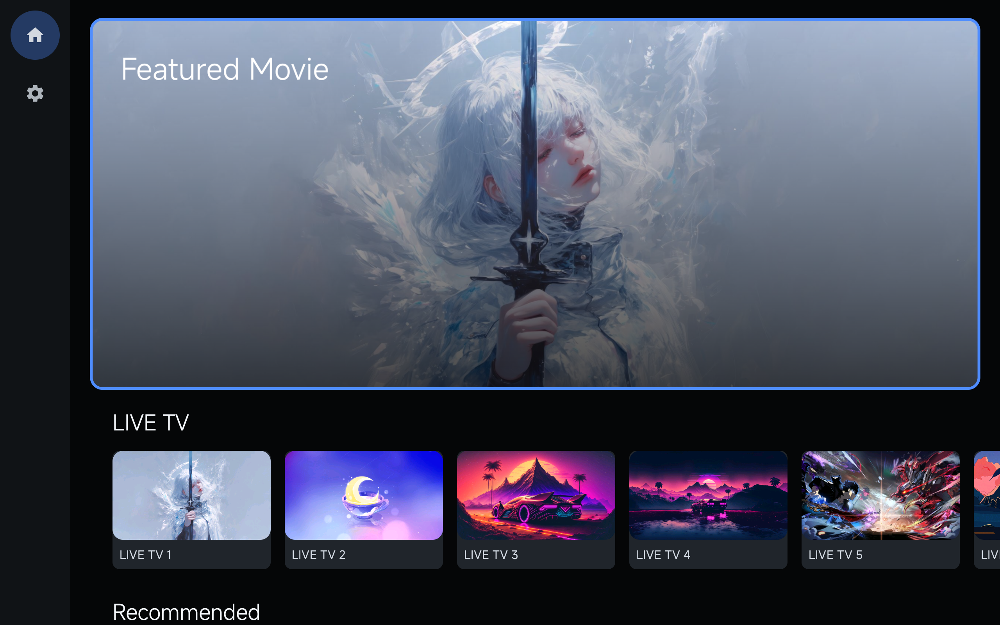
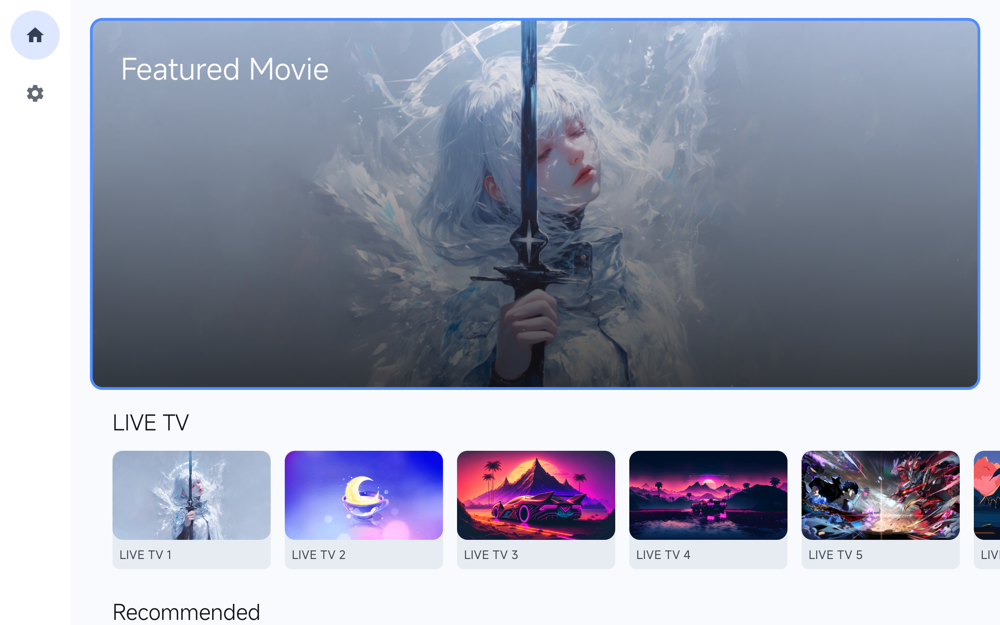
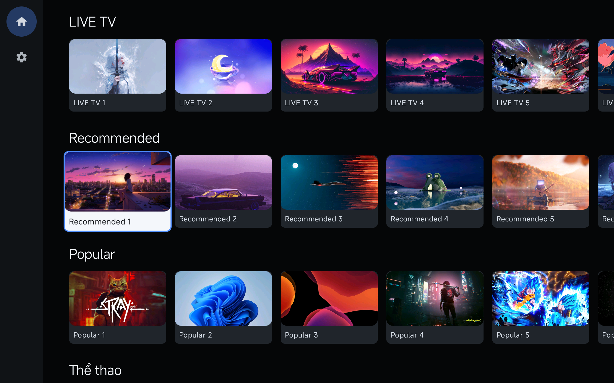
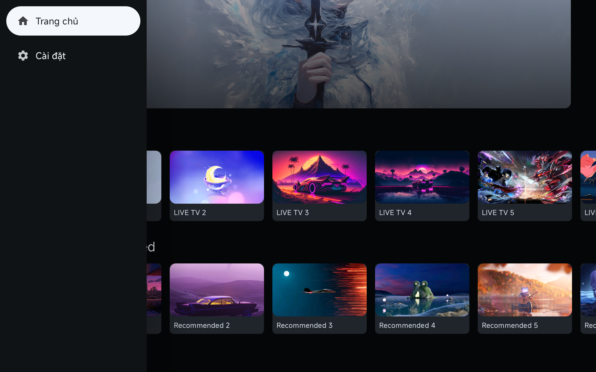
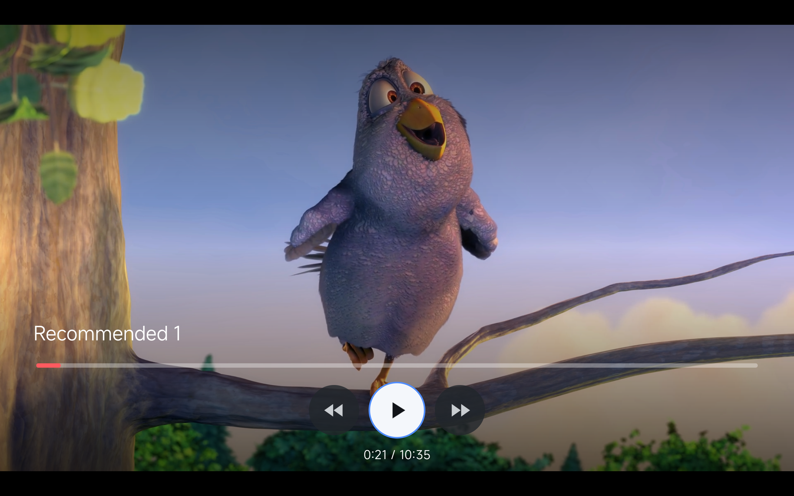
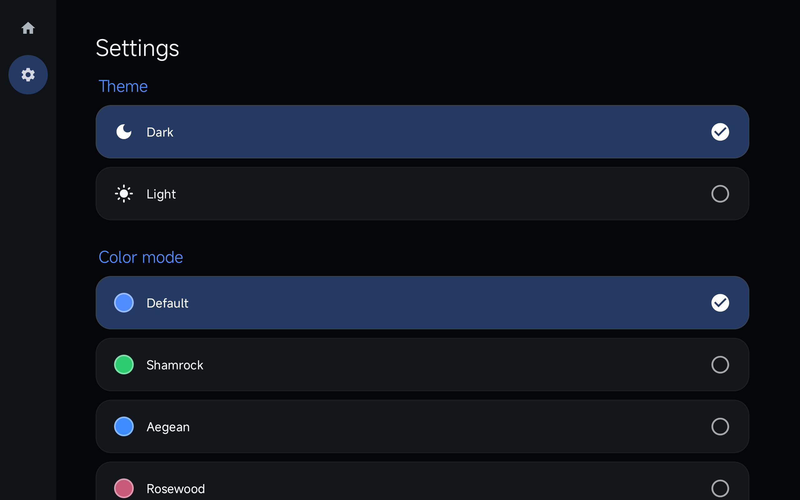

# Android TV Compose

Modern Android TV application built with Jetpack Compose for TV.

---

# Preview

| Home Dark | Home Light |
|---|---|
|  |  |

| Browse Content | Navigation Drawer |
|---|---|
|  |  |

| Player | Settings |
|---|---|
|  |  |

---

# Features

- Jetpack Compose for TV
- Android TV D-pad navigation
- Modal Navigation Drawer
- Focus restoration
- LazyRow / LazyColumn content rails
- Featured banner
- Media3 ExoPlayer integration
- LIVE + VOD playback
- Dynamic theme system
- Dark / Light mode
- Accent color customization
- TV optimized UI

---

# Tech Stack

- Kotlin
- Jetpack Compose for TV
- Navigation Compose
- Hilt
- LiveData
- Clean Architecture
- MVVM
- Retrofit
- Coil
- Media3 ExoPlayer

---

# Architecture

Architecture style:
- Clean Architecture
- MVVM
- feature-based structure
- single activity architecture

Project structure:

```txt
core/
├── designsystem/
├── network/
├── player/
├── focus/
├── result/
├── ui/
└── util/

feature/
├── home/
├── player/
├── settings/
└── detail/

navigation/
```

---

# Android TV Focus System

The project includes:
- focus restoration
- D-pad optimized navigation
- stable LazyRow focus behavior
- NavigationDrawer focus handling
- custom focused item positioning

TV requirements:
- preserve focus after navigation
- avoid random focus jumps
- preserve scroll position

---

# Player

Supports:
- LIVE playback
- VOD playback

LIVE:
- no pause
- no seek
- minimal controls

VOD:
- full playback controls
- seek support
- playback progress

Built with:
- Media3 ExoPlayer

---

# Theme System

Supports:
- Dark mode
- Light mode
- Dynamic accent colors
- Font scaling

Uses:
- Material 3
- CompositionLocal

---

# Documentation

Docs:
- `docs/architecture.md`
- `docs/tv-guidelines.md`
- `agents.md`

---

# Performance Notes

Optimized for Android TV:
- stable focus navigation
- minimized recompositions
- optimized image loading
- TV-safe scrolling behavior
- low-memory friendly image decode sizes

---

# License

MIT
